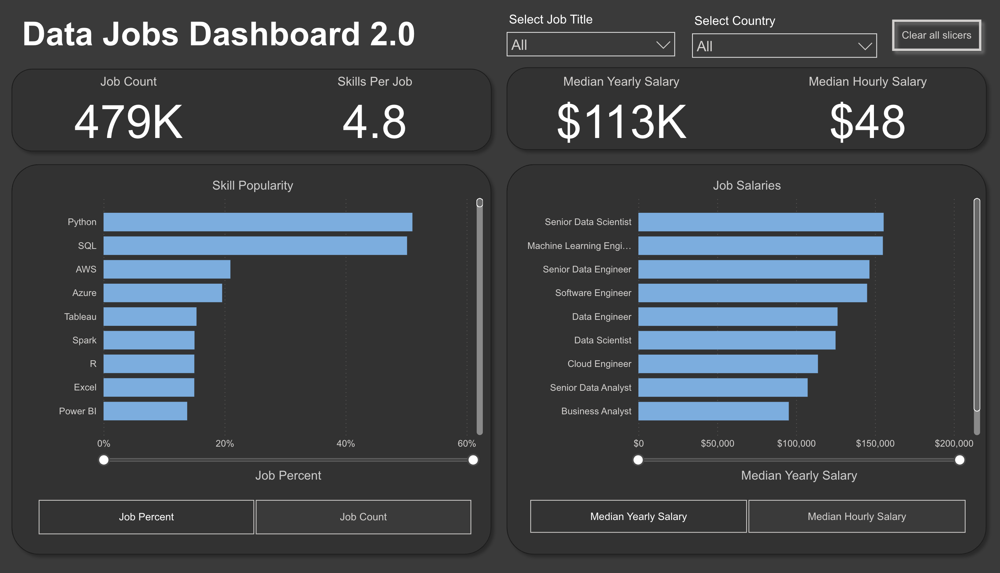

# Data Jobs Dashboard 2.0 — Power BI

## Introduction

This is the second iteration of my Data Jobs Dashboard — a refined, single-page version built on the same 2024 data science job postings dataset. Where the first version focused on breadth and drill-through navigation across multiple pages, this version prioritises speed and clarity, consolidating the most critical market insights into one focused interface.

For anyone exploring the data job market — whether comparing salaries, evaluating which skills are most in demand, or understanding where jobs are concentrated globally — this dashboard is designed to answer those questions as efficiently as possible.

### Dashboard File
The dashboard file is here: [`data_jobs_dashboard_2.0.pbix`](data_jobs_dashboard_2.0.pbix)

---

## Skills Showcased

- **🎨 Dashboard Design:** Designed a clean, single-page layout that prioritises clarity and avoids visual clutter.
- **⚙️ Power Query ETL:** Cleaned and transformed the raw dataset — handling blanks, correcting data types, and shaping the data for analysis.
- **🔗 Data Modelling:** Built an efficient data model using Star Schema principles, establishing relationships between tables for reliable analysis.
- **🧮 DAX Fundamentals:** Created measures and aggregations to derive key metrics including Median Yearly Salary, Median Hourly Salary, and Job Count.
- **📊 Visualisations Used:**
  - **📈 Core Charts:** Column, Bar, Line, and Area charts for comparisons and trend analysis
  - **🗺️ Map Charts:** Geospatial visualisation of global job distribution
  - **🔢 Cards:** Headline KPI metrics at a glance
  - **📋 Tables:** Granular, sortable data for detailed exploration
- **🖱️ Interactive Features:**
  - **Slicers:** Dynamic filtering across the entire report
  - **Buttons & Bookmarks:** Seamless navigation and view management

---

## Dashboard Overview

This single page serves as concise mission control for the data job market. At a glance it surfaces the key metrics that matter most to anyone evaluating their options — **Job Count, Skills Per Job, Median Yearly Salary, and Median Hourly Salary**. It also breaks down **Skill Popularity** by job percentage and count, and allows direct salary comparisons across job titles — all in one place, with no need to navigate between pages.

---

## Conclusion

This project was an exercise in restraint as much as technical skill — taking everything learned in Version 1.0 and asking: what's the most important information, and what's the clearest way to show it? The result is a more mature, focused dashboard that reflects how data products evolve in practice — from exploration to refinement.

---

*Built by [Soroush Ariana](https://github.com/Soroush-Ariana) — Data Analyst based in Nottingham, UK*
*📧 arianasoroush@gmail.com*
